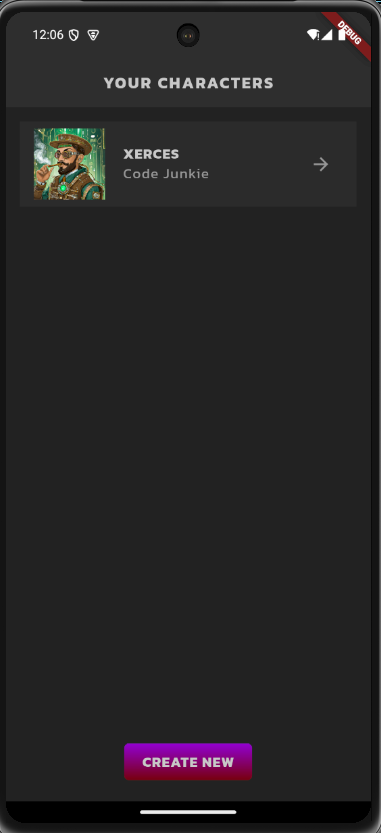
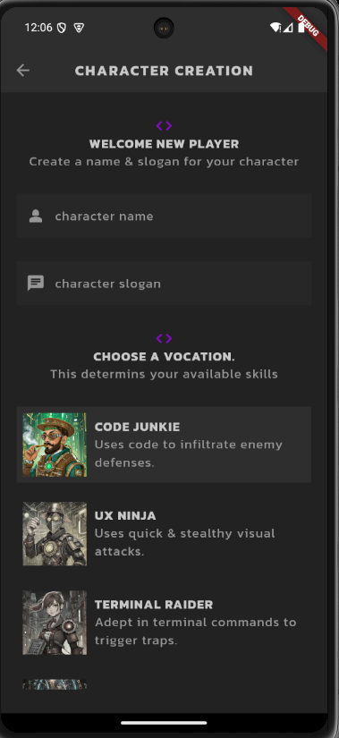
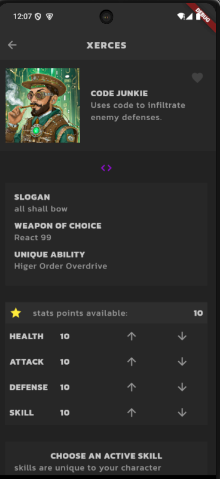

# Flutter RPG Character Creator

A mobile application built with Flutter that allows users to create and manage RPG characters. Players can customize their character's stats, choose different vocations, and save their favorite character builds.

## Features

- Create unique characters with custom names and slogans

- Choose from multiple character vocations (Junkie, Ninja, Raider, Wizard)

- Customize character stats and skills

- Mark favorite characters

- Persistent storage using Firebase

- Animated UI elements

- Hero transitions between screens

## Screenshots





## Tech Stack

- Flutter

- Firebase (for data persistence)

- Provider (state management)

- Google Fonts

- Custom animations

- Hero transitions

## Installation

1\. Clone the repository

```bash

git clone [https://github.com/prime-infinity/flutter_rpg]

```

2\. Install dependencies

```bash

flutter pub get

```

3\. Configure Firebase

- Create a new Firebase project

- Add your `google-services.json` (Android) and/or `GoogleService-Info.plist` (iOS)

- Update Firebase options in the project

4\. Run the app

```bash

flutter run

```

## Project Structure

- `lib/screens/` - Main app screens (Home, Create, Profile)

- `lib/models/` - Data models (Character, Vocation, Skills)

- `lib/services/` - Business logic and state management and firestore integration

- `lib/shared/` - Reusable widgets and styles

- `lib/theme.dart` - App theming and styling

## Contributing

Feel free to submit issues and enhancement requests!
